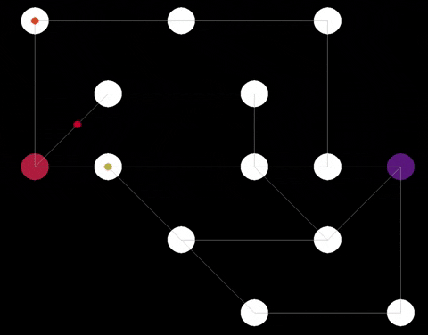

# Lem_in

	This project is about finding the quickest way to get ants from start-room to end-room.
	Quickest way means the solution with the least number of lines, respecting the
	rules below.

**Rules**

- All found pahts must be disjoint.
- At the beginning all ants are in start-room.
- Each room can only contain one ant at a time. (expet start-room and end-room)
- Ants have to avoid traffic jams as well as walking all over their fellow ants.
- At each turn each ant can be moved only once and the room at the receiving end must be empty.

**Usage**

	install sdl libraries for visualisation:
	
	brew install SDL2
	brew install SDL2_ttf
	brew install SDL2_image
	brew install SDL2_gfx
	brew install SDL2_mixer

	make
	./lem-in < <data>

	run with visualisation:
	./lem-in < <data> | ./visual

**Visualisation has done by <a href="https://github.com/Sddoo">Vlad Portnov</a>**

